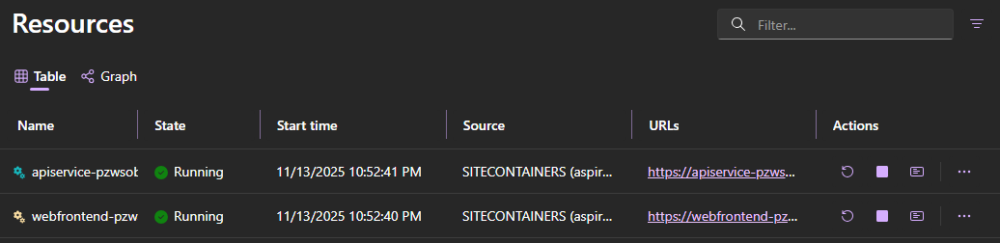
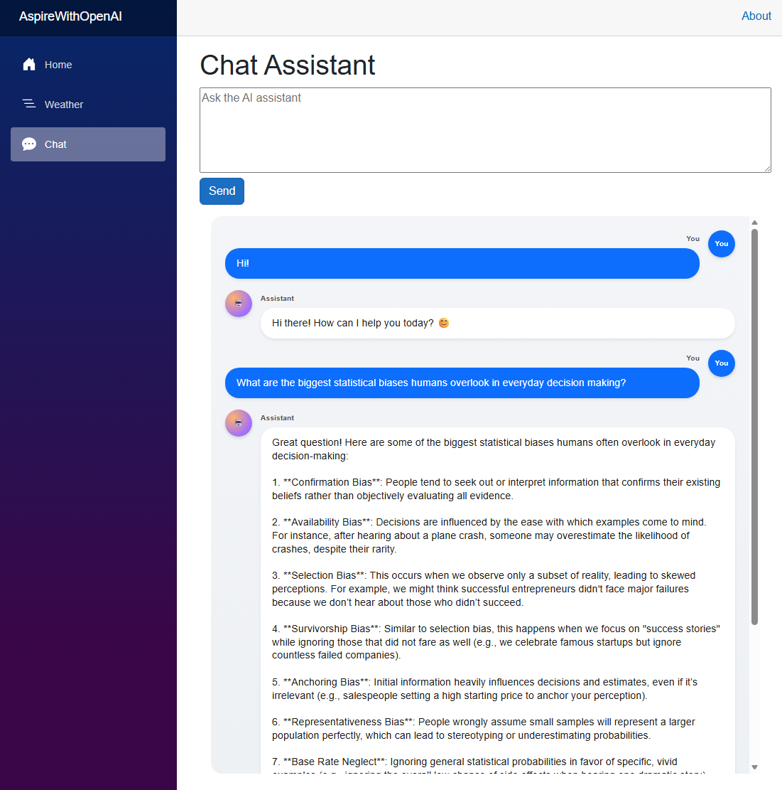

# .NET Aspire Sample: OpenAI Integration

This sample demonstrates integrating an Azure OpenAI resource and two .NET projects (API + Web frontend) into a single **.NET Aspire** application for local development and eventual deployment to Azure App Service.

## Architecture

| Component | Type | Purpose |
|-----------|------|---------|
| `openai` | Azure OpenAI (or connection string) | Provides access to the model (GPT-4o) deployment. Fallback to configured connection string if provided. |
| `apiservice` | ASP.NET Core API | Exposes endpoints that call Azure OpenAI (chat/completions) & weather features. |
| `webfrontend` | ASP.NET Core Web (Blazor/Razor) | Frontend UI consuming the API. |
| AppHost | .NET Aspire orchestrator | Wires resources, projects, health checks, and references; launches the Aspire dashboard. |

## Prerequisites

* .NET 10 SDK or later
* Docker Desktop
* Azure subscription (requires Owner access to the target subscription for role assignments)
* Aspire CLI or Azure Developer CLI (to deploy to Azure App Service)
* Optional: Visual Studio 2022 17.14

### Azure OpenAI Setup for Local Testing

1. Provision an Azure OpenAI resource in the Azure Portal.
2. Create a model deployment..
3. Capture the endpoint and configure Managed Identity.
4. Provide the connection strings via `appsettings*.json` or user secrets.

> [!NOTE]
> Prefer Managed Identity; do **not** commit keys.

## Running the App (Local)

### Visual Studio

1. Open the solution file `AspireWithOpenAI.sln`.
2. Set the startup project to `AspireWithOpenAI.AppHost`.
3. Debug / Run; the Aspire dashboard opens automatically.

### .NET CLI

From the `AspireWithOpenAI.AppHost` directory:

```powershell
cd samples/AspireWithOpenAI/AspireWithOpenAI.AppHost
dotnet run
```

The dashboard URL will be printed; open it in your browser to view resources.

## Deployment

You can deploy this Aspire application to Azure App Service using either the **Azure Developer CLI (azd)** or the **Aspire CLI**.

### Option 1: Azure Developer CLI (azd)

* Navigate to the AppHost directory:

    ```powershell
    cd samples/AspireWithOpenAI/AspireWithOpenAI.AppHost
    ```

* Initialize azd (select subscription + create an environment name):

    ```powershell
    azd init
    ```

* (If not already logged in) authenticate:

    ```powershell
    az login
    ```

* Synthesize infrastructure templates from the Aspire model (Optional):

    ```powershell
    azd infra synth
    ```

* Deploy:

    ```powershell
    azd up
    ```

### Option 2: Aspire CLI

Use for fastest path when you don't need to hand-edit infra templates initially.

* Navigate to the AppHost directory:

    ```powershell
    cd samples/AspireWithOpenAI/AspireWithOpenAI.AppHost
    ```

* Authenticate to Azure (if not already):

    ```powershell
    az login
    ```

* Deploy:

    ```powershell
    aspire deploy
    ```

* When prompted:
   1. Choose subscription
   2. Choose region (must support Azure OpenAI if creating resource)
   3. Confirm resource names

## Experiencing the App

In the Aspire dashboard you will see:

* `openai` (Azure OpenAI resource or connection string)
* `apiservice` (API) – view logs, health, and endpoints
* `webfrontend` (Web UI)


Navigate to the Web frontend endpoint to interact with chat functionality and weather features.


---
> [!IMPORTANT]
> Avoid embedding raw credentials. Prefer Azure AD auth or Key Vault references with Managed Identity.
