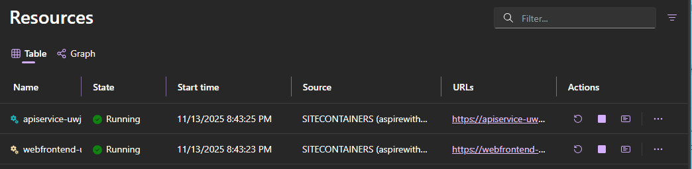

# .NET Aspire Sample: Python API + React Frontend

This sample shows how to orchestrate a **Python FastAPI-style (generic)** service and a **Node/React (Vite)** frontend with .NET Aspire. The AppHost wires ports, environment variables, and ordering.

## Architecture

| Component | Type | Purpose |
|-----------|------|---------|
| `apiservice` | Python app (`main.py`) | Provides HTTP API (weather). |
| `webfrontend` | Npm/React app (Vite) | Consumes the Python API; environment variable `APISERVICE_BASE_URL` injected by AppHost. Published as a Dockerfile for deployment. |
| AppHost | .NET Aspire orchestrator | Defines resources, health, env wiring, and dashboard surfacing. |

## Prerequisites

* .NET 10 SDK or later
* Python 3.11+
* Node.js 20.x (or latest LTS)
* Docker Desktop
* Azure subscription (requires Owner access to the target subscription for role assignments)
* Aspire CLI or Azure Developer CLI (to deploy to Azure App Service)
* Optional: Visual Studio 2022 17.14+

## Running the App (Local)

### Visual Studio

Open `AspireWithPythonAndReact.sln`, set startup to `AspireWithPythonAndReact.AppHost`, Run/Debug.

### .NET CLI

```powershell
cd samples/AspireWithPythonAndReact/AspireWithPythonAndReact.AppHost
dotnet run
```

## Deployment

You can deploy this Aspire application to Azure App Service using either the **Azure Developer CLI (azd)** or the **Aspire CLI**.

### Option 1: Azure Developer CLI (azd)

* Navigate to the AppHost directory:

    ```powershell
    cd samples/AspireWithOpenAI/AspireWithOpenAI.AppHost
    ```

* Initialize azd (select subscription + create an environment name):

    ```powershell
    azd init
    ```

* (If not already logged in) authenticate:

    ```powershell
    az login
    ```

* Synthesize infrastructure templates from the Aspire model:

    ```powershell
    azd infra synth
    ```

* Deploy:

    ```powershell
    azd up
    ```

### Option 2: Aspire CLI

Use for fastest path when you don't need to hand-edit infra templates initially.

* Navigate to the AppHost directory:

    ```powershell
    cd samples/AspireWithOpenAI/AspireWithOpenAI.AppHost
    ```

* Authenticate to Azure (if not already):

    ```powershell
    az login
    ```

* Deploy:

    ```powershell
    aspire deploy
    ```

* When prompted:
   1. Choose subscription
   2. Choose region (must support Azure OpenAI if creating resource)
   3. Confirm resource names

## Experiencing the App

The dashboard lists the Python API and React frontend with endpoints.


## Environment Variable Wiring

| Variable | Provided By | Target | Purpose |
|----------|-------------|--------|---------|
| `APISERVICE_BASE_URL` | AppHost | React frontend | Points frontend to Python API endpoint. |
| `ALLOWED_ORIGINS` | AppHost | Python API | Enables CORS for frontend origin. |

---
> [!IMPORTANT]
> Avoid embedding raw credentials. Prefer Azure AD auth or Key Vault references with Managed Identity.
