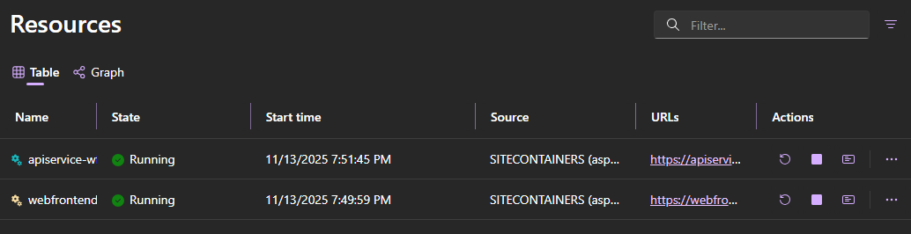

# .NET Aspire Sample: SQL Server Integration

This sample demonstrates a .NET Aspire application that provisions an Azure SQL Server & Database and connects an API + Web frontend. Database migrations are applied automatically via a hosted service.

## Architecture

| Component | Type | Purpose |
|-----------|------|---------|
| `sqlsrv` | Azure SQL Server | Host server instance for the application database. |
| `aspiredb` | Azure SQL Database | Application database (default SKU). |
| `apiservice` | ASP.NET Core API | Provides weather data backed by EF Core (`WeatherForecastContext`); runs migrations via `DatabaseMigrations`. |
| `webfrontend` | ASP.NET Core Web UI | Consumes the API weather endpoint. |
| AppHost | .NET Aspire orchestrator | Declares SQL resources, references, health checks, ordering, dashboard. |

## Database & Migrations

* `Program.cs` registers EF Core using `builder.AddSqlServerDbContext<WeatherForecastContext>(connectionName: "aspiredb");`
* Hosted service `DatabaseMigrations` runs automatic migrations at startup.
* Weather data is seeded/generated and served via `/weatherforecast`.
* To add a new entity:
  1. Update the DbContext & entity models.
  2. Add a migration: `dotnet ef migrations add <Name> -p AspireWithSql.ApiService -s AspireWithSql.ApiService` (ensure tools installed).
  3. The hosted service will apply new migrations on next run.

## Prerequisites

* .NET 10 SDK or later
* Docker Desktop
* Azure subscription (requires Owner access to the target subscription for role assignments)
* Aspire CLI or Azure Developer CLI (to deploy to Azure App Service)
* Optional: Visual Studio 2022 17.14+

## Running the App (Local)

### Visual Studio

Open `AspireWithSql.sln`, set startup to `AspireWithSql.AppHost`, Run/Debug. The Aspire dashboard will appear.

### .NET CLI

```powershell
cd samples/AspireWithSql/AspireWithSql.AppHost
dotnet run
```

## Deployment

You can deploy this Aspire application to Azure App Service using either the **Azure Developer CLI (azd)** or the **Aspire CLI**.

### Option 1: Azure Developer CLI (azd)

* Navigate to the AppHost directory:

    ```powershell
    cd samples/AspireWithOpenAI/AspireWithOpenAI.AppHost
    ```

* Initialize azd (select subscription + create an environment name):

    ```powershell
    azd init
    ```

* (If not already logged in) authenticate:

    ```powershell
    az login
    ```

* Synthesize infrastructure templates from the Aspire model:

    ```powershell
    azd infra synth
    ```

* Deploy:

    ```powershell
    azd up
    ```

### Option 2: Aspire CLI

Use for fastest path when you don't need to hand-edit infra templates initially.

* Navigate to the AppHost directory:

    ```powershell
    cd samples/AspireWithOpenAI/AspireWithOpenAI.AppHost
    ```

* Authenticate to Azure (if not already):

    ```powershell
    az login
    ```

* Deploy:

    ```powershell
    aspire deploy
    ```

* When prompted:
   1. Choose subscription
   2. Choose region (must support Azure OpenAI if creating resource)
   3. Confirm resource names

## Experiencing the App

The dashboard lists `apiservice`, and `webfrontend` with statuses and endpoints.



---
> [!IMPORTANT]
> Avoid embedding raw credentials. Prefer Azure AD auth or Key Vault references with Managed Identity.
